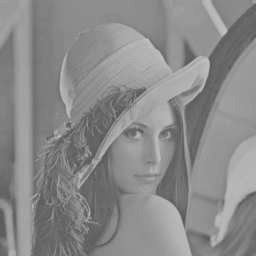
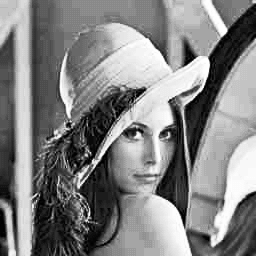
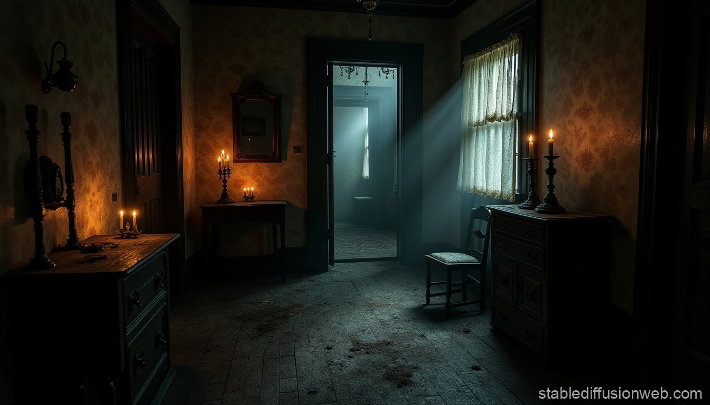
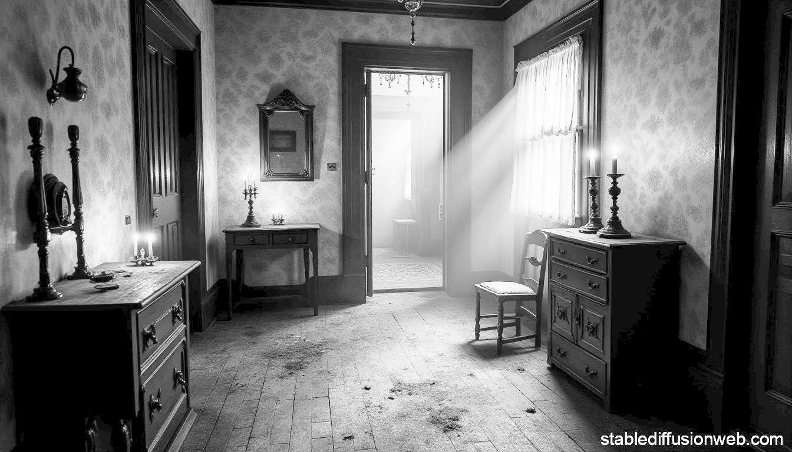
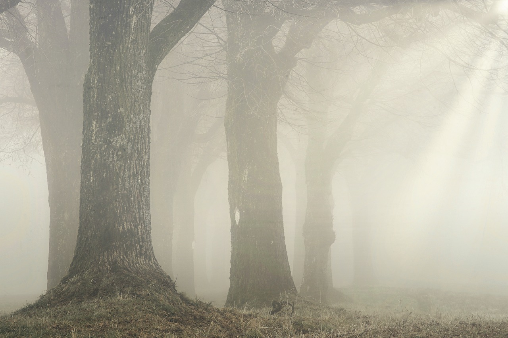
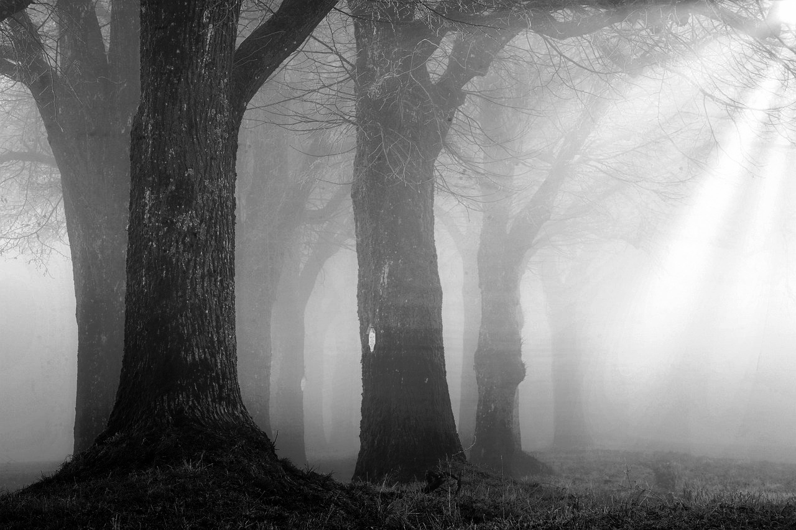
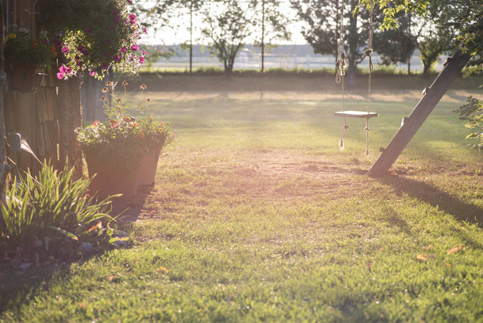
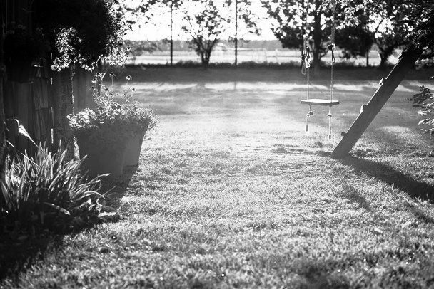
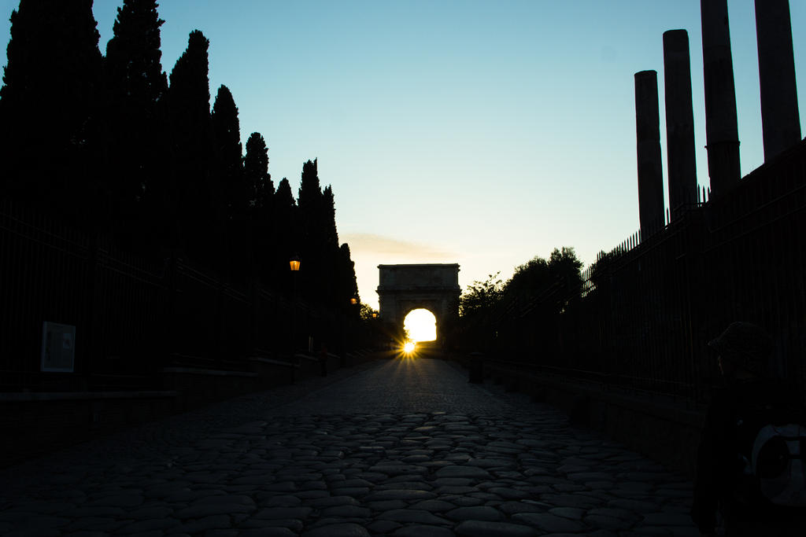

# 🎨 **Histogram Equalization to improve Image Contrast**
🚀 *Confronto tra implementazioni **sequenziale** e **parallela con CUDA***

> Questo progetto esplora l'**Histogram Equalization** per migliorare il contrasto di immagini, confrontando una versione **sequenziale** e una **parallela** ottimizzata con **OpenMP**.

---

## 🛠️ **Caratteristiche**
- ⬆️ **Miglioramento contrasto di immagini** tramite **Histogram Equalization**.
- ⏱️ **Confronto delle performance** tra versioni sequenziale e parallela.
- 📁 Supporto per file immagine `.jpg`, `.png` e `.bmp`.
- 💾 Salvataggio dei risultati in una cartella dedicata.

---

## 🖥️ **Linguaggi e librerie usati**
✅ **C++**  
✅ **OpenCV** (per l'elaborazione delle immagini).  
✅ **CUDA** (per la parallelizzazione).  
✅ **MSVC** (per compilare).  
✅ **CMake** (per build multi-piattaforma).

---

## ⚙️ **Utilizzo**
1. **Aggiungi immagini** nella directory `./img`. Alcune immagini di esempio di varie dimensioni sono già presenti all'interno del progetto
2. **Esegui il programma**
3. **Seleziona un'immagine** dalla lista visualizzata nel terminale (immagini presenti nella directory `./img`) e **scegli quale versione di Histogram Equalization** da usare.
4. Guarda i risultati nella directory `./img_results` e controlla il tempo di esecuzione della versione scelta.

💡 *Il programma mostrerà i tempi di esecuzione per l'implementazione scelta!*

---

## 🗂️ **Immagini Risultanti:**
Le immagini saranno salvate in:
- **`./img_results/equalized_seq_nameimage.jpg`**
- **`./img_results/equalized_par_nameimage.jpg`**

---

## 🎉 **Contributi**
💡 Questo progetto è stato realizzato da **Giovanni Stefanini**, per il superamento dell'esame di Parallel Computing.

---

### 👀 **Demo Visiva**
Miglioramento del contrasto tramite Equalizzazione dell'istogramma per le immagini di esempio:

| **Input Originale**                                                                | **Eq. Sequenziale**                                                                                      | **Eq. Parallela** |  
|------------------------------------------------------------------------------------|----------------------------------------------------------------------------------------------------------|------------------------------|  
|   |   |  |  
|    |    |  |  
|          |          |  |
|    |    |  |  
|   |   |  |  
|   |   |  |
|  |  |  |
