# 🎨 **Histogram Equalization to Improve Image Contrast**
🚀 *Comparison between **sequential** and **parallel** implementations*

> This project explores **Histogram Equalization** to enhance image contrast, comparing a **sequential** version with an optimized **parallel** version using **CUDA**.

---  

## 🛠️ **Features**
- ⬆️ **Image contrast enhancement** through **Histogram Equalization**.
- ⏱️ **Performance comparison** between sequential and parallel versions.
- 📁 Support for `.jpg`, `.png`, and `.bmp` image files.
- 💾 Results are saved in a dedicated folder.

---  

## 🖥️ **Languages and Libraries Used**
✅ **C++**  
✅ **OpenCV** (for image processing).  
✅ **CUDA** (for parallelization).  
✅ **MSVC** + **nvcc** (for compilation).  
✅ **CMake** (for cross-platform build).

---  

## ⚙️ **Usage**
1. **Add images** to the `./img` directory. Some sample images of various sizes are already included in the project.
2. **Run the program**.
3. **Select an image** from the list displayed in the terminal (images inside the `./img` directory).
4. View the results in the `./img_results` directory and check the execution time for both versions.

💡 *The program will display execution times for both implementations!*

---  

## 🗂️ **Resulting Images:**
The images will be saved in:
- **`.\img_results\color`**
- **`.\img_results\gray`**

---  

## 📄 **Report**
A copy of the report (in Italian) can be found [here📄](./report/Parallel_Computing_Second_Course_Project_Giovanni_Stefanini.pdf).

A copy of the presentation can be found [here📄](./report/Parallel_Computing_Second_Course_Project_Giovanni_Stefanini.pdf).

---  

## 🎉 **Contributions**
💡 This project was developed by **Giovanni Stefanini**, as part of the Parallel Computing course exam.

---  

### 👀 **Visual Demo**
Contrast enhancement using Histogram Equalization on sample images:

| **Original Input**                                                                | **Seq. Equalization**                                                                                           | **Parallel Equalization**                                                                                                    |  
|------------------------------------------------------------------------------------|---------------------------------------------------------------------------------------------------------------|----------------------------------------------------------------------------------------------------------------------|  
|   |  | 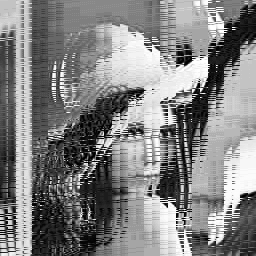 |  
|    | 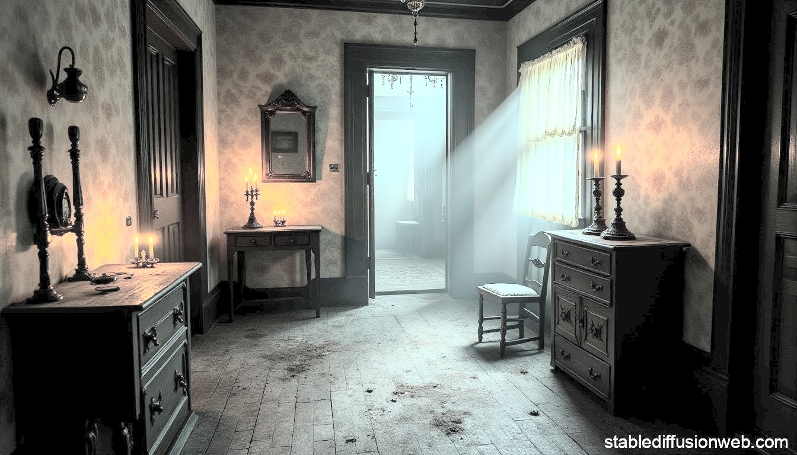        |         |  
|          | 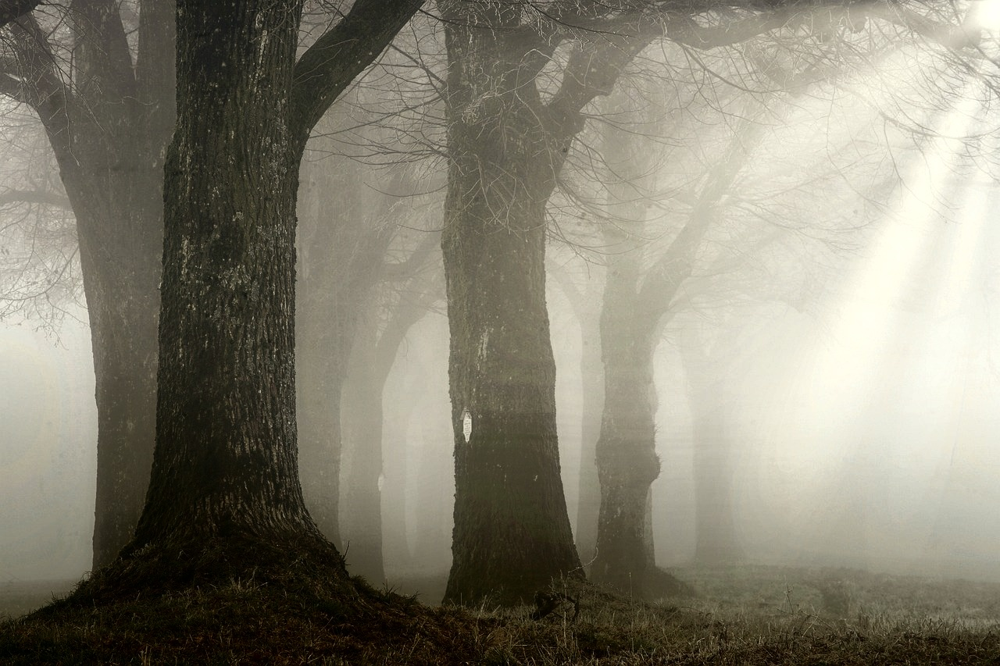              | 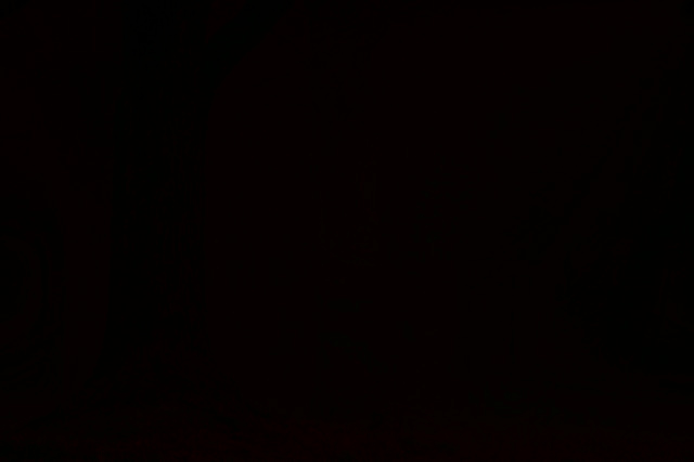              |
|    | 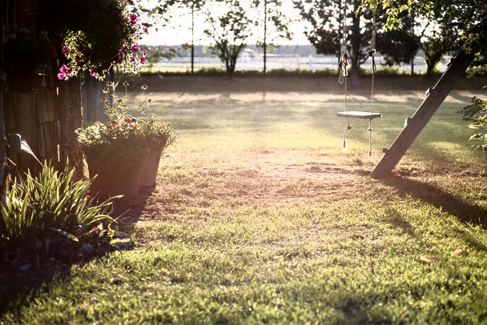        |         |  
|   | 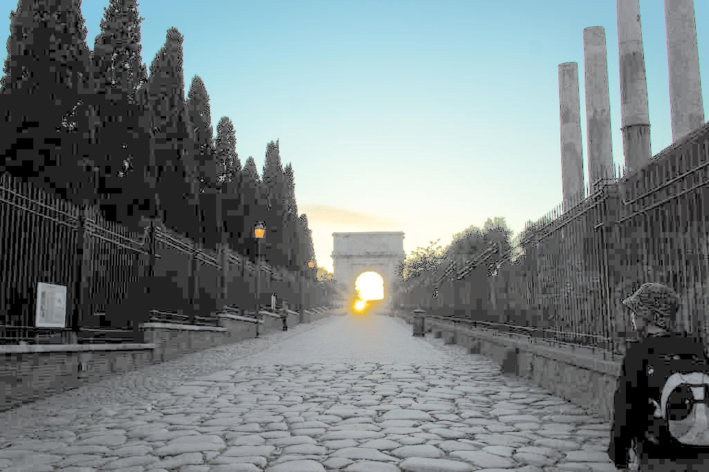       |        |  
| 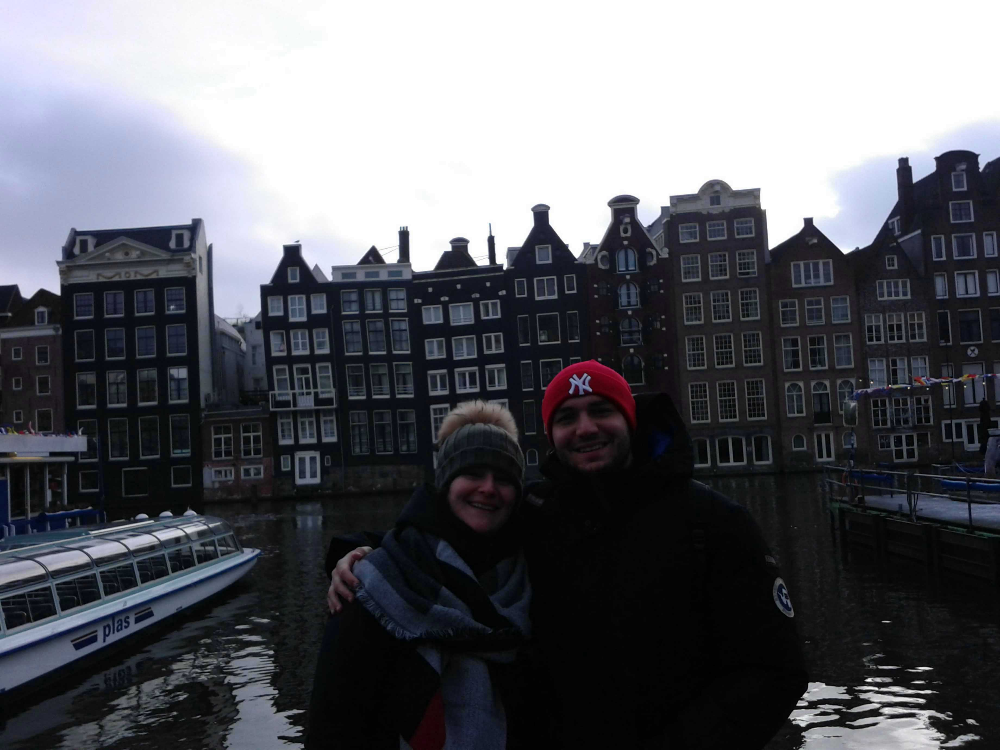  | 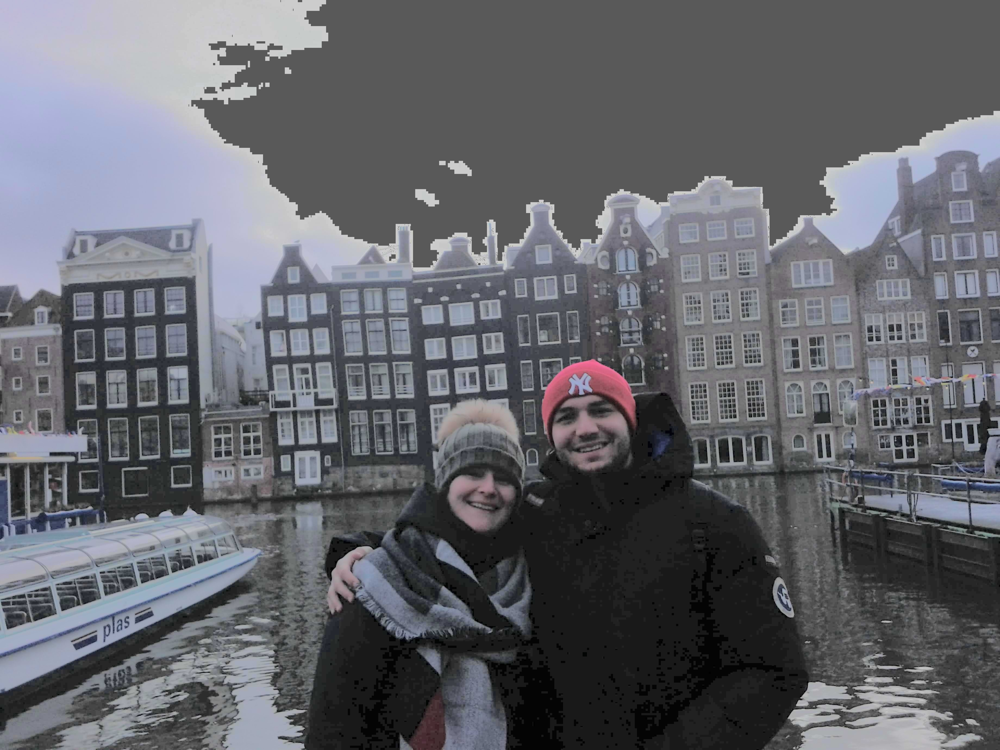       | 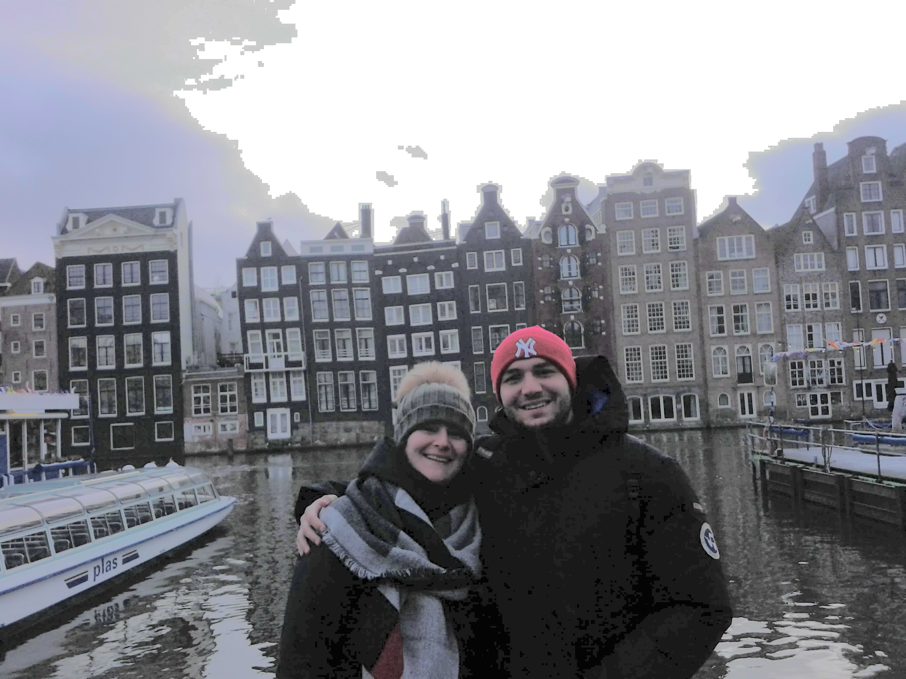       |
| 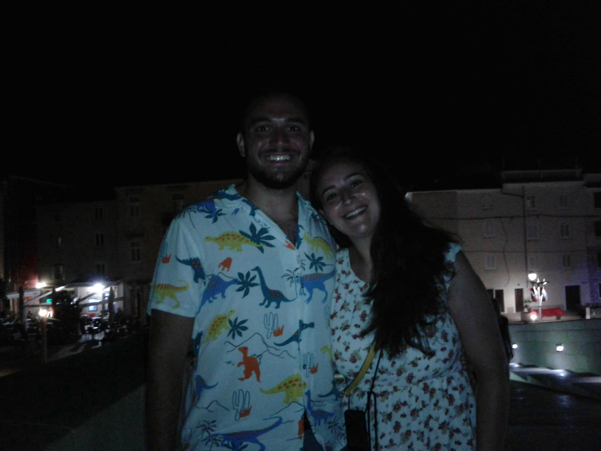 | 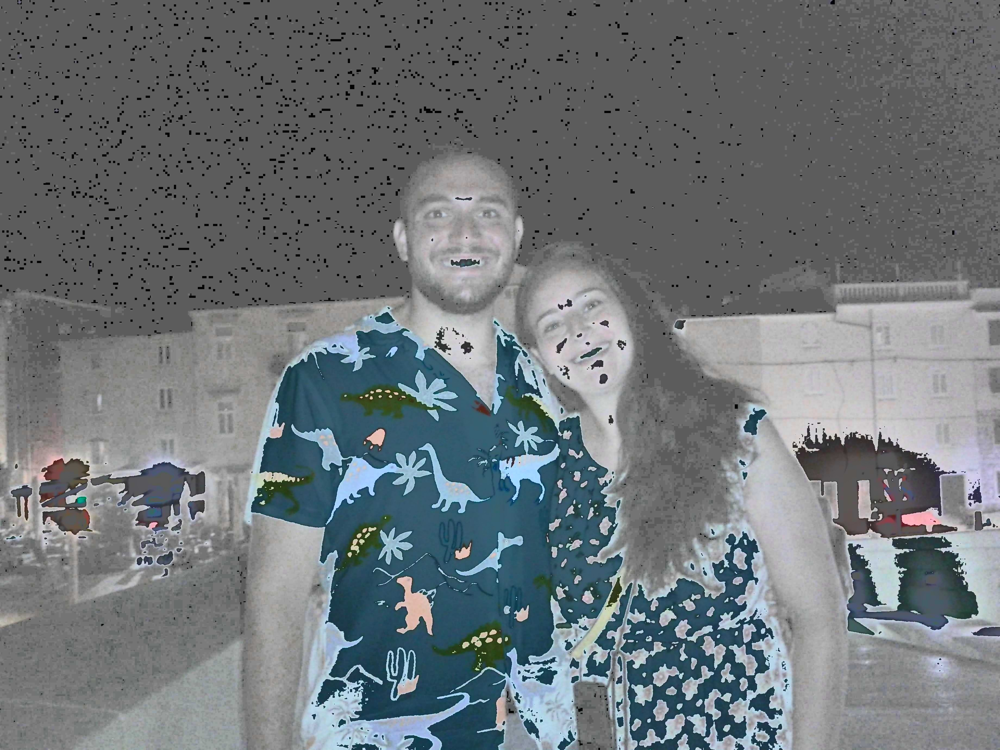      | 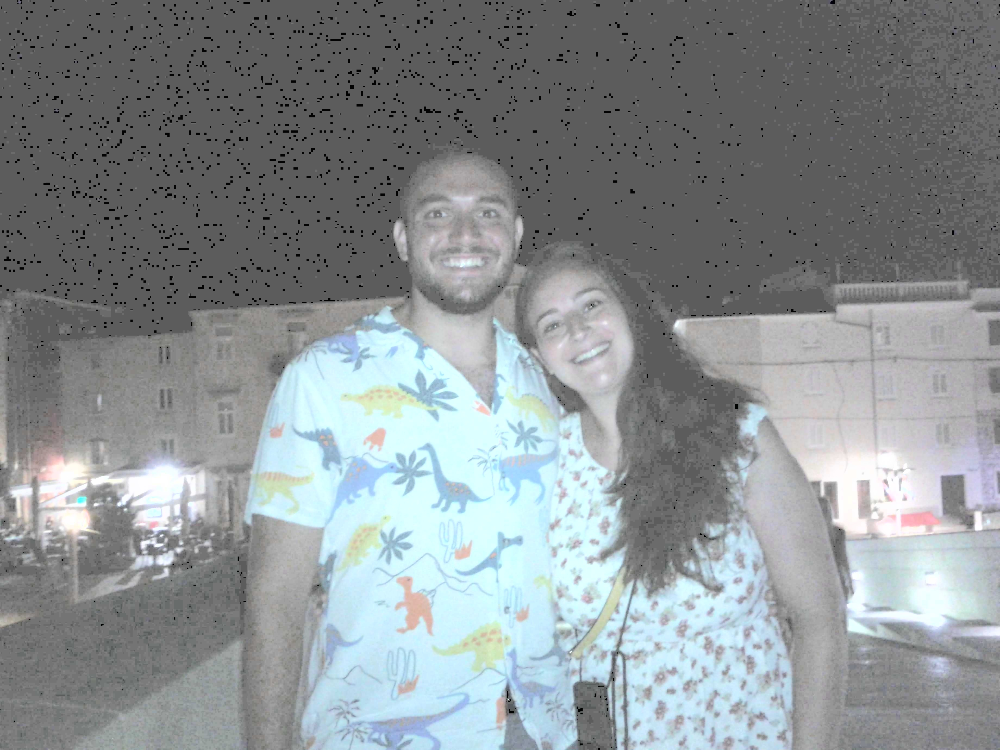      |
|  | 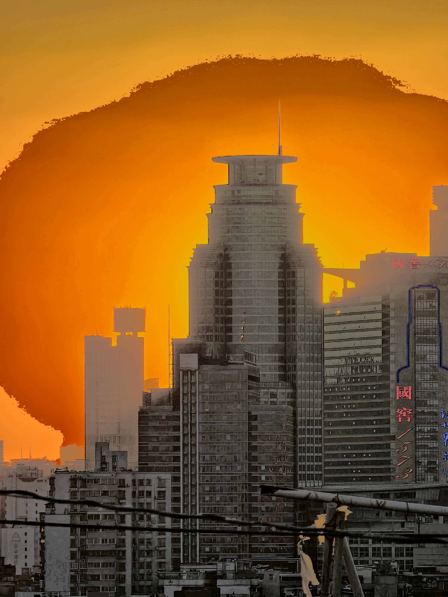     | 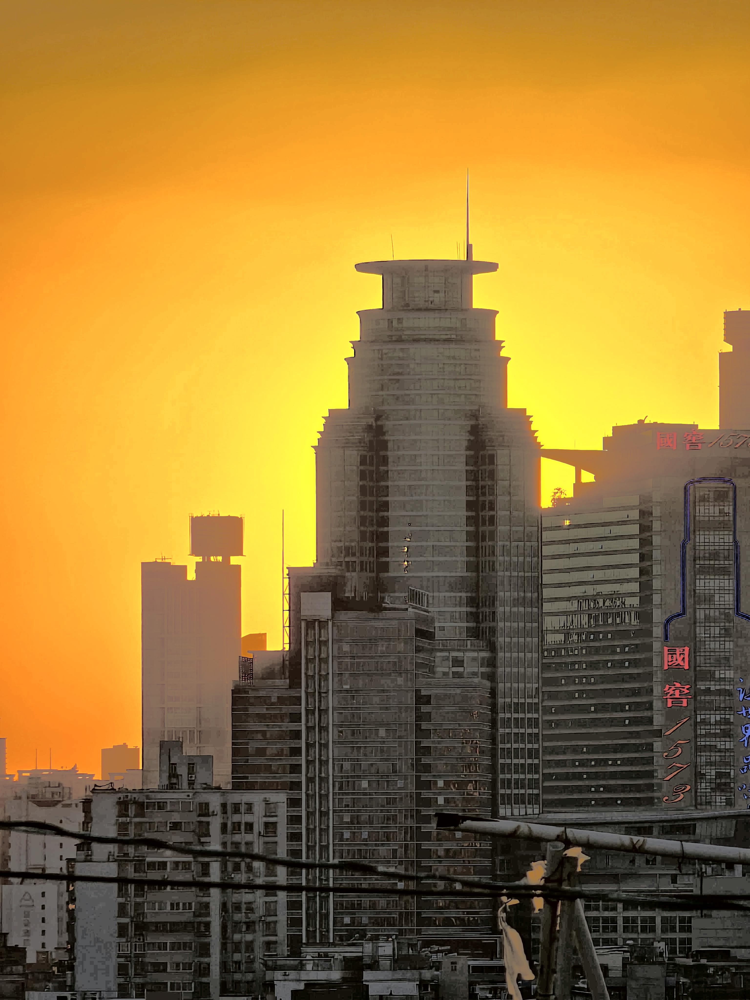     |
